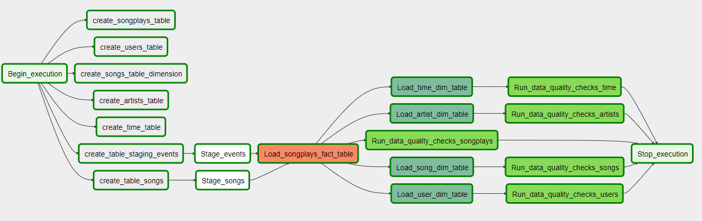

# Sparkify's Data Pipeline with Airflow
## Introduction
Sparkify wants to analyze the data they've been collecting on songs and user activity on their new music streaming app. The project will set up a data pipeline to do the following:
- Stage songs and events data from AWS S3 to Redshift
- Perofrm transformations to create star schema
- Run data quality checks
## Project Description
Apply the knowledge of Apache Airflow to build and ETL pipeline for a Data Lake hosted on Amazon S3.

In this project, we would have to create our own custom operators to perform tasks such as staging the data, filling the data warehouse and running checks on the data as the final step. We have been provided with four empty operators that need to be implemented into functional pieces of a data pipeline.
## Datasets
- **Song Dataset**: The first dataset is a subset of real data from the Million Song Dataset. [Million Song Dataset.](http://millionsongdataset.com/) Each file is in JSON format and contains metadata about a song and the artist of that song. The files are partitioned by the first three letters of each song's track ID.
- **Log Dataset**: The second dataset consists of log files in JSON format and generated by this event simulator based on the songs in the dataset above. These simulate app activity logs from a music streaming app based on specified configurations.

## Data Schema and Design
### Fact Table
- **songplays** - records in log data associated with song plays i.e. records with page NextSong.
  - songplay_id, start_time, user_id, level, song_id, artist_id, session_id, location, user_agent
 
 ### Dimension Tables
 - **users** - users in the app
   - user_id, first_name, last_name, gender, level
  - **time** - timestamps of records in songplays broekn down into specific units
    - start_time, hour, day, week, month, year, weekday
 - **artists** - artists in music database
   - artist_id, name, location, latitude, longitude
  - **songs** - songs in the music database
    - song_id, title, artist_id, year, duration
   
 
 ### Data pipeline in Apache Airflow

## Configurations and Operators
In the DAG, add  `default parameters`  according to these guidelines

-   The DAG does not have dependencies on past runs
-   On failure, the task are retried 3 times
-   Retries happen every 5 minutes
-   Catchup is turned off
-   Do not email on retry
### Stage Operator

The stage operator is expected to be able to load any JSON formatted files from S3 to Amazon Redshift. The operator creates and runs a SQL COPY statement based on the parameters provided. The operator's parameters should specify where in S3 the file is loaded and what is the target table.

The parameters should be used to distinguish between JSON file. Another important requirement of the stage operator is containing a templated field that allows it to load timestamped files from S3 based on the execution time and run backfills.

### Fact and Dimension Operators

With dimension and fact operators, you can utilize the provided SQL helper class to run data transformations. Most of the logic is within the SQL transformations and the operator is expected to take as input a SQL statement and target database on which to run the query against. You can also define a target table that will contain the results of the transformation.

Dimension loads are often done with the truncate-insert pattern where the target table is emptied before the load. Thus, you could also have a parameter that allows switching between insert modes when loading dimensions. Fact tables are usually so massive that they should only allow append type functionality.

### Data Quality Operator

The final operator to create is the data quality operator, which is used to run checks on the data itself. The operator's main functionality is to receive one or more SQL based test cases along with the expected results and execute the tests. For each the test, the test result and expected result needs to be checked and if there is no match, the operator should raise an exception and the task should retry and fail eventually.
## Setup
1. Setup Apache Airflow in Project Workspace
2. Add in the necessary connections (AWS, connection to Redshift, etc)
3. Run the DAG script
